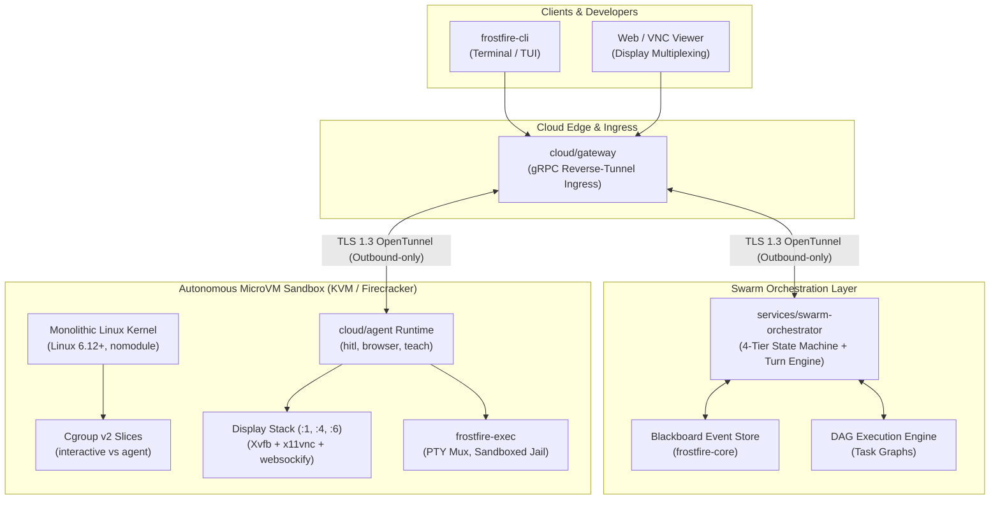

# Frostfire Cloud

**Private Cloud Control Plane, MicroVM Virtualization Infrastructure & Swarm Orchestrator**

[]()
[]()
[]()

Frostfire Cloud is an enterprise virtualization platform, secure edge ingress gateway, and multi-agent swarm orchestration control plane designed specifically for autonomous AI agents. It instantiates, supervises, and coordinates isolated Linux microVMs where autonomous coding agents, browser automation engines, and computer-use models can safely execute arbitrary code, run graphical applications, and collaborate across complex engineering workflows.

---

## Architecture Overview



---

## Key Capabilities

* **Outbound-Only Reverse Ingress**: Edge nodes and guest microVMs connect outbound to the Cloud Gateway via bidirectional gRPC streams (`OpenTunnel`) over TLS 1.3. MicroVMs expose no listening ports to the public Internet.
* **Instantaneous MicroVM Provisioning**: Monolithic KVM kernels (`Linux 6.12+`) combined with copy-on-write `overlayfs` root filesystems deliver sub-second boot times and instant workspace branching.
* **Multi-Display Session Multiplexing**: Independent virtual framebuffers (`:1`, `:4`, `:6`) pair headless browser automation, human-in-the-loop (HITL) takeovers, and computer-use models with authenticated VNC streams.
* **Dynamic Swarm Teams**: Tasks spawn domain-specific agent swarms (Architects, QA, DX, and Staff Engineers) coordinated through an append-only Blackboard event store and directed acyclic graph (DAG) state machine.
* **Strict Cgroup v2 Isolation**: Distinct scheduling priorities preserve smooth window manager and VNC interactivity (`interactive` slice) even when compilers and test suites exhaust CPU resources (`agent` slice).

---

## Repository Layout

```
frostfire-cloud/
├── cloud/                        # Virtualization & edge runtime
│   ├── gateway/                  # Outbound reverse-tunnel edge gateway terminating client gRPC streams
│   ├── agent/                    # In-VM agent runtime (hitl, browser, teach, computer-use)
│   └── microvm/                  # MicroVM rootfs build scripts, display multiplexers, and run scripts
├── services/                     # Central cloud orchestration services
│   └── swarm-orchestrator/       # 4-tier swarm state machine, Blackboard store, and Gemini turn engine
├── crates/                       # Core Rust workspace crates
│   ├── frostfire-proto/          # Protobuf / gRPC service contracts (AgentTunnelService.OpenTunnel)
│   ├── frostfire-tunnel/         # Bidirectional gRPC streaming client and tunnel multiplexer
│   ├── frostfire-exec/           # Sandboxed execution jail, PTY mux, worktrees, and semantic chunker
│   ├── frostfire-security/       # Keystore brokers, credential persistence, and tamper-evident audit ledgers
│   ├── frostfire-mcp/            # Model Context Protocol (MCP) proxy, supervisor, and protocol types
│   ├── frostfire-daemon/         # Background host daemon connecting local agents to the control plane
│   ├── frostfire-core/           # Blackboard pattern, DAG models, sprint planning, and task synthesis
│   ├── frostfire-engine/         # Gemini LLM turn engine, dynamic provider routing, and resilience loops
│   └── frostfire-cli/            # Developer CLI, interactive terminal UI, and browser bridges
├── deploy/                       # Infrastructure-as-Code (IaC) definitions
│   ├── aws/                      # CloudFormation templates for nested-KVM / bare-metal hypervisors
│   ├── gcp/                      # Cloud Run & Deployment Manager configurations with KVM virtualization
│   ├── docker/                   # Container definitions & docker-compose.yml for local stacks
│   └── proxmox/                  # Proxmox LXC cluster deployment automation
├── scripts/                      # Lifecycle & cluster provisioning scripts
│   ├── setup-cluster.sh          # Turnkey multi-user microVM cluster installer
│   ├── gcp-setup-wizard.sh       # Automated GCP nested-KVM instance provisioner
│   └── cloud-start.ps1           # AWS host lifecycle automation
└── docs/                         # Exhaustive technical specifications
    ├── MICROVM_ARCHITECTURE.md   # Complete reverse-engineered microVM hypervisor & display blueprint
    └── AGENT_TEAMS_SPEC.md       # Dynamic context-driven agent-teams orchestration specification
```

---

## Architectural Invariants

Every component in Frostfire Cloud is built against strict architectural invariants documented in [`AGENTS.md`](./AGENTS.md):

1. **Outbound-Only Ingress**: Cloud Gateway routes agents via reverse-stream `OpenTunnel`. Guest daemons initiate TLS 1.3 outbound connections. No inbound public ports.
2. **MicroVM Isolation**: MicroVM instances run on isolated bridge networks (`172.16.x.0/24` or `172.30.0.0/24`). Never bridge unauthenticated guest networks to the public internet.
3. **Tenant Authorization**: All display routes must pass `x-sand-window-owner` token checks with constant-time comparison (`timingSafeEqual` / `subtle::ConstantTimeEq`).
4. **Zero Secrets in Git**: Never commit AWS credentials, private keys, or API tokens. Secrets are dynamically brokered at runtime via `crates/frostfire-security`.

---

## Getting Started

### Prerequisites

* **Linux Host**: Kernel 5.15+ with KVM hardware virtualization enabled (`/dev/kvm`).
* **Rust Toolchain**: Rust 1.80+ (2021 Edition).
* **Protocol Buffers**: `protoc` compiler for gRPC contract compilation.
* **Dependencies**: `qemu-utils`, `firecracker` or `cloud-hypervisor`, `bridge-utils`, `x11vnc`, `xvfb`.

### Building the Workspace

```bash
# Clone the repository
git clone https://github.com/tysongoulding/frostfire-cloud.git
cd frostfire-cloud

# Build all workspace crates
cargo build --workspace

# Run full unit and integration test suite
cargo test --workspace

# Run static linter with strict warning enforcement
cargo clippy --workspace -- -D warnings
```

### Local Cluster Deployment

For quick local testing using Docker:

```bash
cd deploy/docker
docker compose up -d
```

For provisioning a production microVM host with KVM isolation:

```bash
sudo ./scripts/setup-cluster.sh
```

---

## Documentation

* [**MicroVM Architecture Specification**](./docs/MICROVM_ARCHITECTURE.md): In-depth blueprint of kernel flags, cgroup v2 domains, display multiplexing, and crash-loop prevention mechanics.
* [**Dynamic Agent Teams Specification**](./docs/AGENT_TEAMS_SPEC.md): Protocols and roles for dynamic context-driven multi-agent swarms.
* [**Agent Directives & Verification Gates**](./AGENTS.md): Mandatory rules, invariants, and quality gates for contributors and automated agents.

---

## License

Proprietary. All rights reserved. See `Cargo.toml` for metadata.
